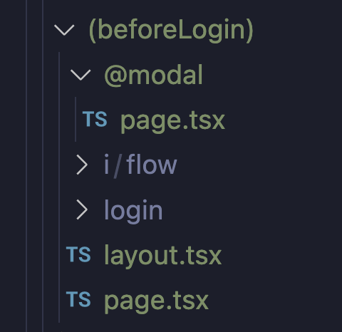

## slug

다이나믹 라우팅 [] 로 작성하면

## template.tsx, layout.tsx 차이

새롭게 mount 되게 하고 싶을 때 -> template.tsx
리렌더링이 되지 않게 하고 싶을 때 -> layout.tsx

## Parallel Routes

Parallel Routes는 동일한 레이아웃 내에서 하나 이상의 페이지를 동시에 또는 조건부로 렌더링 할 수 있는 방법.

슬롯을 사용해 병렬로 페이지를 렌더링 하는데, 슬롯 규칙은 폴더 앞에 '@'를 사용한다.

슬롯으로 사용될 modal과 layout.tsx는 같은 폴더 안에 있어야 에러가 나지 않는다.

## 클라이언트 컴포넌트로 전환하기

Next의 모든 컴포넌트는 서버 컴포넌트이다.
그래서 useState, useEffect 같은 Hook을 사용하지 못하는데 클라이언트 컴포넌트로 전환하면 사용할 수 있다.
방법은 클라이언트 컴포넌트로 전환하고 싶은 컴포넌트 상단에 `use client`라고 작성하면 된다.

## default.tsx

Paraller Route의 기본값

## Intercepting Routes

현재 레이아웃 안에서 라우트를 로드하면서 현재 페이지의 컨텍스트를 유지할 수 있게 해주는 방법

예를 들어, 피드에서 사진을 클릭했을 때, 오버레이된 피드 위에 사진을 모달로 띄울 수 있다.

** 컨벤션 **
가로채려는 폴더가 같은 레벨에 있는 `i/flow/login` 이라면
intecepting routes는 `(.)i/flow/login` 이렇게 작성하면 된다.

Link를 통해서 url에 접근하는 경우 intercept가 발생하여 `(.)i/flow/login`가 렌더링되고, 브라우저에 직접 url을 치거나, 새로고침하면 기존의 `i/flow/login` 가 렌더링된다.

## Private folder

** 컨벤션 **
`_folder` 이런식으로 작성하면 이 폴더는 route로 생성되지 않는다. @modal/(.)i/flow/login과 i/flow/login에 공통된 로직을 `_component` 폴더로 분리한다.
